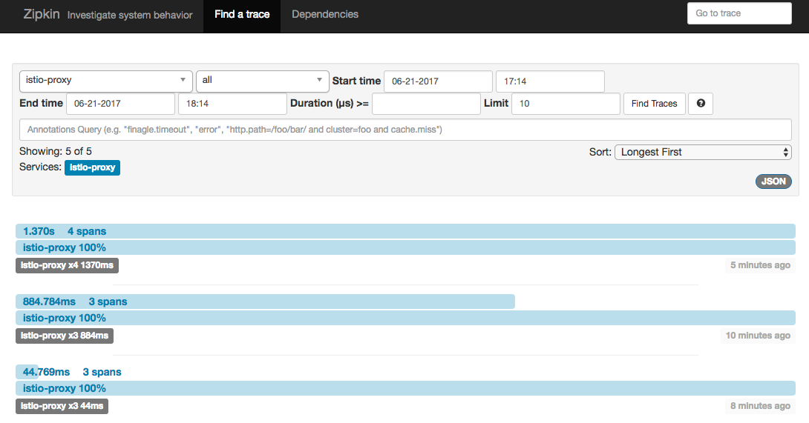
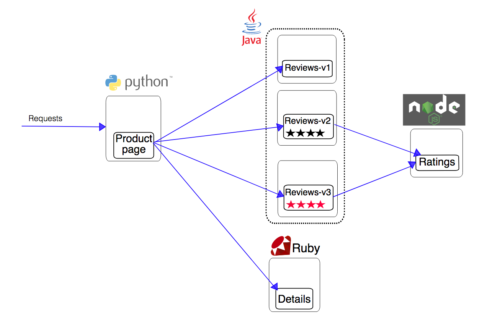
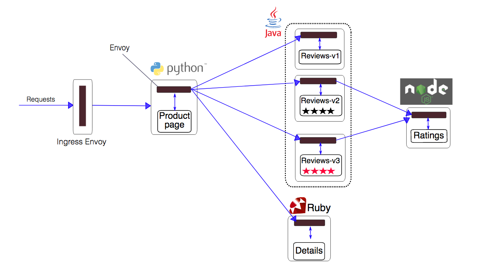

# Istio

Istio是Google、IBM和Lyft联合开源的微服务Service Mesh框架，旨在解决大量微服务的发现、连接、管理、监控以及安全等问题。

Istio的主要特性包括：

- HTTP、gRPC和TCP网络流量的自动负载均衡
- 丰富的路由规则，细粒度的网络流量行为控制
- 流量加密、服务间认证，以及强身份声明
- 全范围（Fleet-wide）策略执行
- 深度遥测和报告

## 原理

Istio从逻辑上可以分为数据平面和控制平面：

- 数据平面主要由一系列的智能代理（Envoy）组成，管理微服务之间的网络通信
- 控制平面负责管理和配置这些智能代理，并动态执行策略

Istio架构可以如下图所示


主要由以下组件构成

- [Envoy](https://lyft.github.io/envoy/)：Lyft开源的高性能代理总线，支持动态服务发现、负载均衡、TLS终止、HTTP/2和gPRC代理、健康检查、性能测量等功能。Envoy以sidecar的方式部署在相关的服务的Pod中。
- Mixer：负责访问控制、执行策略并从Envoy代理中收集遥测数据。Mixer支持灵活的插件模型，方便扩展
- Pilot：用户和Istio的接口，验证用户提供的配置和路由策略并发送给Istio组件，管理Envoy示例的生命周期
- Istio-Auth：提供服务间和终端用户的认证机制

## 安装

> Istio目前仅支持Kubernetes，在部署Istio之前需要先部署好Kubernetes集群并配置好kubectl客户端。

### 下载Istio

```sh
curl -L https://git.io/getIstio | sh -
cd istio-0.1.6/
cp bin/istioctl /usr/local/bin/
```

### 创建RBAC角色和绑定

```sh
$ kubectl apply -f install/kubernetes/istio-rbac-beta.yaml
clusterrole "istio-pilot" created
clusterrole "istio-ca" created
clusterrole "istio-sidecar" created
rolebinding "istio-pilot-admin-role-binding" created
rolebinding "istio-ca-role-binding" created
rolebinding "istio-ingress-admin-role-binding" created
rolebinding "istio-sidecar-role-binding" created
```

如果碰到下面的错误

```
Error from server (Forbidden): error when creating "install/kubernetes/istio-rbac-beta.yaml": clusterroles.rbac.authorization.k8s.io "istio-pilot" is forbidden: attempt to grant extra privileges: [{[*] [istio.io] [istioconfigs] [] []} {[*] [istio.io] [istioconfigs.istio.io] [] []} {[*] [extensions] [thirdpartyresources] [] []} {[*] [extensions] [thirdpartyresources.extensions] [] []} {[*] [extensions] [ingresses] [] []} {[*] [] [configmaps] [] []} {[*] [] [endpoints] [] []} {[*] [] [pods] [] []} {[*] [] [services] [] []}] user=&{user@example.org [...]
```

需要给用户授予admin权限

```sh
kubectl create clusterrolebinding myname-cluster-admin-binding --clusterrole=cluster-admin --user=myname@example.org
```

### 部署Istio核心服务

两种方式（选择其一执行）

- 禁止Auth：`kubectl apply -f install/kubernetes/istio.yaml`
- 启用Auth：`kubectl apply -f install/kubernetes/istio-auth.yaml`

### 部署Prometheus、Grafana和Zipkin插件

```sh
kubectl apply -f install/kubernetes/addons/prometheus.yaml
kubectl apply -f install/kubernetes/addons/grafana.yaml
kubectl apply -f install/kubernetes/addons/servicegraph.yaml
kubectl apply -f install/kubernetes/addons/zipkin.yaml
```

等一会所有Pod启动后，可以通过NodePort或负载均衡服务的外网IP来访问这些服务。比如通过NodePort方式，先查询服务的NodePort

```sh
$ kubectl get svc grafana -o jsonpath='{.spec.ports[0].nodePort}'
32070
$ kubectl get svc servicegraph -o jsonpath='{.spec.ports[0].nodePort}'
31072
$ kubectl get svc zipkin -o jsonpath='{.spec.ports[0].nodePort}'
30032
$ kubectl get svc prometheus -o jsonpath='{.spec.ports[0].nodePort}'
30890
```

通过`http://<kubernetes-ip>:32070/dashboard/db/istio-dashboard`访问Grafana服务


通过`http://<kubernetes-ip>:31072/dotviz`访问ServiceGraph服务，展示服务之间调用关系图


通过`http://<kubernetes-ip>:30032`访问Zipkin跟踪页面



通过`http://<kubernetes-ip>:30890`访问Prometheus页面


## 部署示例应用

在部署应用时，需要通过`istioctl kube-inject`给Pod自动插入Envoy容器，即

```sh
kubectl create -f <(istioctl kube-inject -f <your-app-spec>.yaml)
```

比如Istio提供的BookInof示例：

```sh
kubectl apply -f <(istioctl kube-inject -f samples/apps/bookinfo/bookinfo.yaml)
```

原始应用如下图所示



`istioctl kube-inject`在原始应用的每个Pod中插入了一个Envoy容器



服务启动后，可以通过Ingress地址`http://<ingress-address>/productpage`来访问BookInfo应用

```sh
$ kubectl describe ingress
Name:			gateway
Namespace:		default
Address:		192.168.0.77
Default backend:	default-http-backend:80 (10.8.0.4:8080)
Rules:
  Host	Path	Backends
  ----	----	--------
  *
    	/productpage 	productpage:9080 (<none>)
    	/login 		productpage:9080 (<none>)
    	/logout 	productpage:9080 (<none>)
Annotations:
Events:	<none>
```


## 参考文档

- <https://istio.io/>
- [Istio - A modern service mesh](https://istio.io/talks/istio_talk_gluecon_2017.pdf)
- <https://lyft.github.io/envoy/>
