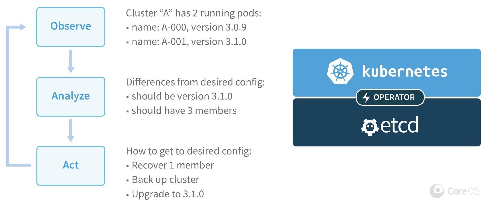

# Operator

Operator是CoreOS推出的旨在简化复杂有状态应用管理的框架，它是一个感知应用状态的控制器，通过扩展Kubernetes API来自动创建、管理和配置应用实例。

## Operator原理

Operator基于Third Party Resources扩展了新的应用资源，并通过控制器来保证应用处于预期状态。比如etcd operator通过下面的三个步骤模拟了管理etcd集群的行为：

1. 通过Kubernetes API观察集群的当前状态；
2. 分析当前状态与期望状态的差别；
3. 调用etcd集群管理API或Kubernetes API消除这些差别。

## 如何创建Operator

Operator是一个感知应用状态的控制器，所以实现一个Operator最关键的就是把管理应用状态的所有操作封装到配置资源和控制器中。通常来说Operator需要包括以下功能：

- Operator自身以deployment的方式部署
- Operator自动创建一个Third Party Resources资源类型，用户可以用该类型创建应用实例
- Operator应该利用Kubernetes内置的Serivce/ReplicaSet等管理应用
- Operator应该向后兼容，并且在Operator自身退出或删除时不影响应用的状态
- Operator应该支持应用版本更新
- Operator应该测试Pod失效、配置错误、网络错误等异常情况

## 示例

- [Etcd Operator](https://coreos.com/operators/etcd/docs/latest)
- [Prometheus Operator](https://coreos.com/operators/prometheus/docs/latest)
- [Rook Operator](https://github.com/rook/rook)
- [Tectonic Operators](https://coreos.com/tectonic)
- 其他
  - https://github.com/sapcc/kubernetes-operators
  - https://github.com/kbst/memcached
  - https://github.com/krallistic/kafka-operator
  - https://github.com/huawei-cloudfederation/redis-operator
  - https://github.com/upmc-enterprises/elasticsearch-operator
  - https://github.com/pires/nats-operator
  - https://github.com/rosskukulinski/rethinkdb-operator
  - https://istio.io/

## 与其他工具的关系

- StatefulSets：StatefulSets为有状态服务提供了DNS、持久化存储等，而Operator可以自动处理服务失效、备份、重配置等复杂的场景。
- Puppet：Puppet是一个静态配置工具，而Operator则可以实时、动态地保证应用处于预期状态
- Helm：Helm是一个打包工具，可以将多个应用打包到一起部署，而Operator则可以认为是Helm的补充，用来动态保证这些应用的正常运行

## 参考资料

- [Kubernetes Operators](https://coreos.com/operators)
