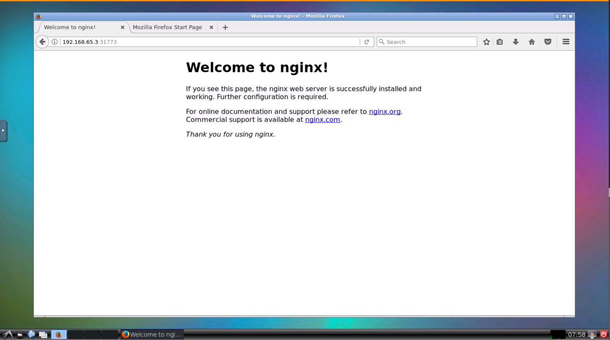

# 利用 LinuxKit 部署 Kubernetes 集群
LinuxKit 是以 Container 来建立最小、不可变的 Linux 系统框架，可以参考 [LinuxKit](https://github.com/linuxkit/linuxkit) 简单介绍。本着则将利用 LinuxKit 来建立 Kubernetes 的映像档，并部署简单的 Kubernetes 集群。


本着教学会在`Mac OS X`系统上进行，部署的环境资讯如下：
* Kubernetes v1.7.2
* Etcd v3
* Weave
* Docker v17.06.0-ce

## 预先准备资讯

* 主机已安装与启动`Docker`工具。
* 主机已安装`Git`工具。
* 主机以下载 LinuxKit 项目，并建构了 Moby 与 LinuxKit 工具。

建构 Moby 与 LinuxKit 方法如以下操作：
```sh
$ git clone https://github.com/linuxkit/linuxkit.git
$ cd linuxkit
$ make
$ ./bin/moby version
moby version 0.0
commit: c2b081ed8a9f690820cc0c0568238e641848f58f

$ ./bin/linuxkit version
linuxkit version 0.0
commit: 0e3ca695d07d1c9870eca71fb7dd9ede31a38380
```

## 建构 Kubernetes 系统映像档
首先要建立一个打包好 Kubernetes 的 Linux 系统，而官方已经有做好范例，利用以下方式即可建构：
```sh
$ cd linuxkit/projects/kubernetes/
$ make build-vm-images
...
Create outputs:
  kube-node-kernel kube-node-initrd.img kube-node-cmdline
```

## 部署 Kubernetes cluster
完成建构映像档后，就可以透过以下指令来启动 Master OS，然后获取节点 IP：
```sh
$ ./boot.sh

(ns: getty) linuxkit-025000000002:~\# ip addr show dev eth0
2: eth0: <BROADCAST,MULTICAST,UP,LOWER_UP> mtu 1500 qdisc pfifo_fast state UP qlen 1000
    link/ether 02:50:00:00:00:02 brd ff:ff:ff:ff:ff:ff
    inet 192.168.65.3/24 brd 192.168.65.255 scope global eth0
       valid_lft forever preferred_lft forever
    inet6 fe80::abf0:9fa4:d0f4:8da2/64 scope link
       valid_lft forever preferred_lft forever
```

启动后，开启新的 Console 来 SSH 进入 Master，来利用 kubeadm 初始化 Master：
```sh
$ cd linuxkit/projects/kubernetes/
$ ./ssh_into_kubelet.sh 192.168.65.3
linuxkit-025000000002:/\# kubeadm-init.sh
...
kubeadm join --token 4236d3.29f61af661c49dbf 192.168.65.3:6443
```

一旦 kubeadm 完成后，就会看到 Token，这时请记住 Token 资讯。接着开启新 Console，然后执行以下指令来启动 Node：
```sh
console1>$ ./boot.sh 1 --token 4236d3.29f61af661c49dbf 192.168.65.3:6443
```
> P.S. 开启节点格式为`./boot.sh <n> [<join_args> ...]`。

接着分别在开两个 Console 来加入集群：
```sh
console2> $ ./boot.sh 2 --token 4236d3.29f61af661c49dbf 192.168.65.3:6443
console3> $ ./boot.sh 3 --token 4236d3.29f61af661c49dbf 192.168.65.3:6443
```

完成后回到 Master 节点上，执行以下指令来查看节点状况：
```sh
$ kubectl get no
NAME                    STATUS    AGE       VERSION
linuxkit-025000000002   Ready     16m       v1.7.2
linuxkit-025000000003   Ready     6m        v1.7.2
linuxkit-025000000004   Ready     1m        v1.7.2
linuxkit-025000000005   Ready     1m        v1.7.2
```

## 简单部署 Nginx 服务
Kubernetes 可以选择使用指令直接建立应用程式与服务，或者撰写 YAML 与 JSON 档案来描述部署应用的配置，以下将建立一个简单的 Nginx 服务：
```sh
$ kubectl run nginx --image=nginx --replicas=1 --port=80
$ kubectl get pods -o wide
NAME                     READY     STATUS    RESTARTS   AGE       IP          NODE
nginx-1423793266-v0hpb   1/1       Running   0          38s       10.42.0.1   linuxkit-025000000004
```

完成后要接着建立 svc(Service)，来提供外部网络存取应用：
```sh
$ kubectl expose deploy nginx --port=80 --type=NodePort
$ kubectl get svc
NAME         CLUSTER-IP      EXTERNAL-IP   PORT(S)        AGE
kubernetes   10.96.0.1       <none>        443/TCP        19m
nginx        10.108.41.230   <nodes>       80:31773/TCP   5s
```

由于不是使用物理机器部署，因此网络使用 Docker namespace 网络，故需透过`ubuntu-desktop-lxde-vnc`来浏览 Nginx 应用：
```sh
$ docker run -it --rm -p 6080:80 dorowu/ubuntu-desktop-lxde-vnc
```
> 完成后透过浏览器连接 [HTML VNC](localhost:6080)。



最后关闭节点只需要执行以下即可：
```sh
$ halt
[ 1503.034689] reboot: Power down
```
