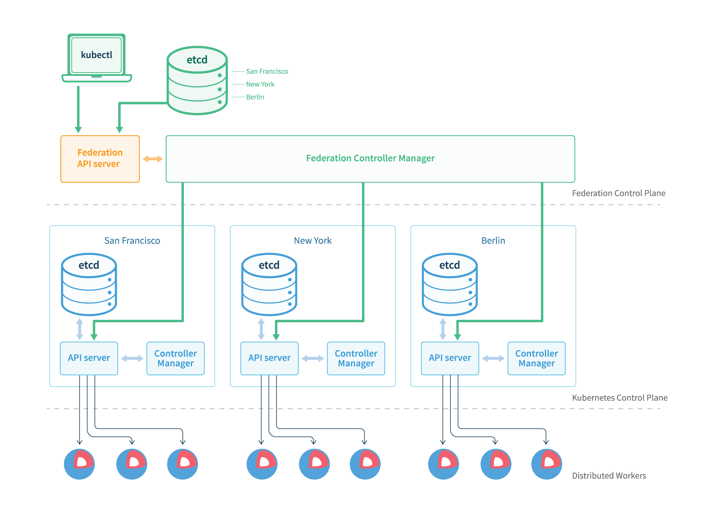

# Kubernetes cluster


一个Kubernetes集群由分布式存储etcd、控制节点controller以及服务节点Node组成。

- 控制节点主要负责整个集群的管理，比如容器的调度、维护资源的状态、自动扩展以及滚动更新等
- 服务节点是真正运行容器的主机，负责管理镜像和容器以及cluster内的服务发现和负载均衡
- etcd集群保存了整个集群的状态

## 集群联邦

集群联邦（Federation）用于跨可用区的Kubernetes集群，需要配合云服务商（如GCE、AWS）一起实现。



## Kubernetes单机版

创建Kubernetes cluster（单机版）最简单的方法是[minikube](https://github.com/kubernetes/minikube):

```sh
$ minikube start                                              
Starting local Kubernetes cluster...  
Kubectl is now configured to use the cluster.
$ kubectl cluster-info
Kubernetes master is running at https://192.168.64.12:8443
kubernetes-dashboard is running at https://192.168.64.12:8443/api/v1/proxy/namespaces/kube-system/services/kubernetes-dashboard

To further debug and diagnose cluster problems, use 'kubectl cluster-info dump'.   
```

