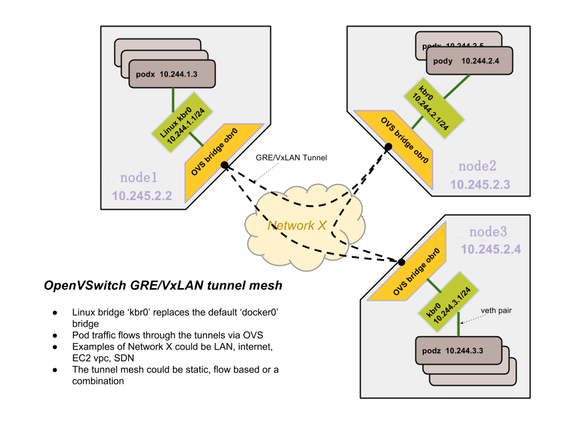

# Kubernetes网络

## Kubernetes网络模型

- IP-per-Pod，每个Pod都拥有一个独立IP地址，Pod内所有容器共享一个网络命名空间
- 集群内所有Pod都在一个直接连通的扁平网络中，可通过IP直接访问
  - 所有容器之间无需NAT就可以直接互相访问
  - 所有Node和所有容器之间无需NAT就可以直接互相访问
  - 容器自己看到的IP跟其他容器看到的一样
- Service cluster IP尽可在集群内部访问，外部请求需要通过NodePort、LoadBalance或者Ingress来访问

## 官方插件

* kubenet：这是一个基于CNI bridge的网络插件（在bridge插件的基础上扩展了port mapping和traffic shaping），是目前推荐的默认插件
* CNI：CNI网络插件，需要用户将网络配置放到`/etc/cni/net.d`目录中，并将CNI插件的二进制文件放入`/opt/cni/bin`
* ~~exec：通过第三方的可执行文件来为容器配置网络，已在v1.6中移除，见[kubernetes#39254](https://github.com/kubernetes/kubernetes/pull/39254)~~

## Host network

最简单的网络模型就是让容器共享Host的network namespace，使用宿主机的网络协议栈。这样，不需要额外的配置，容器就可以共享宿主的各种网络资源。

优点

- 简单，不需要任何额外配置
- 高效，没有NAT等额外的开销

缺点

- 没有任何的网络隔离
- 容器和Host的端口号容易冲突
- 容器内任何网络配置都会影响整个宿主机

## CNI plugin

安装CNI：

```sh
cat <<EOF > /etc/yum.repos.d/kubernetes.repo
[kubernetes]
name=Kubernetes
baseurl=http://yum.kubernetes.io/repos/kubernetes-el7-x86_64
enabled=1
gpgcheck=1
repo_gpgcheck=1
gpgkey=https://packages.cloud.google.com/yum/doc/yum-key.gpg
       https://packages.cloud.google.com/yum/doc/rpm-package-key.gpg
EOF

yum install -y kubernetes-cni
```

配置CNI brige插件：

```sh
    mkdir -p /etc/cni/net.d
cat >/etc/cni/net.d/10-mynet.conf <<-EOF
{
    "cniVersion": "0.3.0",
    "name": "mynet",
    "type": "bridge",
    "bridge": "cni0",
    "isGateway": true,
    "ipMasq": true,
    "ipam": {
        "type": "host-local",
        "subnet": "10.244.0.0/16",
        "routes": [
            { "dst": "0.0.0.0/0"  }
        ]
    }
}
EOF
cat >/etc/cni/net.d/99-loopback.conf <<-EOF
{
    "cniVersion": "0.3.0",
    "type": "loopback"
}
EOF
```

更多CNI网络插件的说明请参考[CNI 网络插件](cni/index.md)。

## [Flannel](flannel/index.md)

[Flannel](https://github.com/coreos/flannel/blob/master/Documentation/kube-flannel.yml)是一个为Kubernetes提供overlay network的网络插件，它基于Linux TUN/TAP，使用UDP封装IP包来创建overlay网络，并借助etcd维护网络的分配情况。

```sh
kubectl create -f https://github.com/coreos/flannel/raw/master/Documentation/kube-flannel-rbac.yml
kubectl create -f https://github.com/coreos/flannel/raw/master/Documentation/kube-flannel.yml
```

## [Weave Net](weave/index.md)

Weave Net是一个多主机容器网络方案，支持去中心化的控制平面，各个host上的wRouter间通过建立Full Mesh的TCP链接，并通过Gossip来同步控制信息。这种方式省去了集中式的K/V Store，能够在一定程度上减低部署的复杂性，Weave将其称为“data centric”，而非RAFT或者Paxos的“algorithm centric”。

数据平面上，Weave通过UDP封装实现L2 Overlay，封装支持两种模式，一种是运行在user space的sleeve mode，另一种是运行在kernal space的 fastpath mode。Sleeve mode通过pcap设备在Linux bridge上截获数据包并由wRouter完成UDP封装，支持对L2 traffic进行加密，还支持Partial Connection，但是性能损失明显。Fastpath mode即通过OVS的odp封装VxLAN并完成转发，wRouter不直接参与转发，而是通过下发odp 流表的方式控制转发，这种方式可以明显地提升吞吐量，但是不支持加密等高级功能。

```sh
kubectl apply -f https://git.io/weave-kube
```

## [Calico](calico/index.md)

[Calico](https://www.projectcalico.org/) 是一个基于BGP的纯三层的数据中心网络方案（不需要Overlay），并且与OpenStack、Kubernetes、AWS、GCE等IaaS和容器平台都有良好的集成。

Calico在每一个计算节点利用Linux Kernel实现了一个高效的vRouter来负责数据转发，而每个vRouter通过BGP协议负责把自己上运行的workload的路由信息像整个Calico网络内传播——小规模部署可以直接互联，大规模下可通过指定的BGP route reflector来完成。 这样保证最终所有的workload之间的数据流量都是通过IP路由的方式完成互联的。Calico节点组网可以直接利用数据中心的网络结构（无论是L2或者L3），不需要额外的NAT，隧道或者Overlay Network。

此外，Calico基于iptables还提供了丰富而灵活的网络Policy，保证通过各个节点上的ACLs来提供Workload的多租户隔离、安全组以及其他可达性限制等功能。

```sh
kubectl apply -f http://docs.projectcalico.org/v2.1/getting-started/kubernetes/installation/hosted/kubeadm/1.6/calico.yaml
```

## OVS

<https://kubernetes.io/docs/admin/ovs-networking/>提供了一种简单的基于OVS的网络配置方法：

- 每台机器创建一个Linux网桥kbr0，并配置docker使用该网桥（而不是默认的docker0），其子网为10.244.x.0/24
- 每台机器创建一个OVS网桥obr0，通过veth pair连接kbr0并通过GRE将所有机器互联
- 开启STP
- 路由10.244.0.0/16到OVS隧道



## [OVN](ovn-kubernetes.md)

[OVN (Open Virtual Network)](http://openvswitch.org/support/dist-docs/ovn-architecture.7.html) 是OVS提供的原生虚拟化网络方案，旨在解决传统SDN架构（比如Neutron DVR）的性能问题。

OVN为Kubernetes提供了两种网络方案：

* Overaly: 通过ovs overlay连接容器
* Underlay: 将VM内的容器连到VM所在的相同网络（开发中）

其中，容器网络的配置是通过OVN的CNI插件来实现。

## [Contiv](contiv/index.md)

[Contiv](http://contiv.github.io)是思科开源的容器网络方案，主要提供基于Policy的网络管理，并与主流容器编排系统集成。Contiv最主要的优势是直接提供了多租户网络，并支持L2(VLAN), L3(BGP), Overlay (VXLAN)以及思科自家的ACI。

## [Romana](romana/index.md)

Romana是Panic Networks在2016年提出的开源项目，旨在借鉴 route aggregation的思路来解决Overlay方案给网络带来的开销。

## [OpenContrail](opencontrail/index.md)

OpenContrail是Juniper推出的开源网络虚拟化平台，其商业版本为Contrail。其主要由控制器和vRouter组成：

* 控制器提供虚拟网络的配置、控制和分析功能
* vRouter提供分布式路由，负责虚拟路由器、虚拟网络的建立以及数据转发

其中，vRouter支持三种模式

* Kernel vRouter：类似于ovs内核模块
* DPDK vRouter：类似于ovs-dpdk
* Netronome Agilio Solution (商业产品)：支持DPDK, SR-IOV and Express Virtio (XVIO)

[Juniper/contrail-kubernetes](https://github.com/Juniper/contrail-kubernetes) 提供了Kubernetes的集成，包括两部分：

* kubelet network plugin基于kubernetes v1.6已经删除的[exec network plugin](https://github.com/kubernetes/kubernetes/pull/39254)
* kube-network-manager监听kubernetes API，并根据label信息来配置网络策略

## [Midonet](midonet/index.md)

[Midonet](https://www.midonet.org/)是Midokura公司开源的OpenStack网络虚拟化方案。

- 从组件来看，Midonet以Zookeeper+Cassandra构建分布式数据库存储VPC资源的状态——Network State DB Cluster，并将controller分布在转发设备（包括vswitch和L3 Gateway）本地——Midolman（L3 Gateway上还有quagga bgpd），设备的转发则保留了ovs kernel作为fast datapath。可以看到，Midonet和DragonFlow、OVN一样，在架构的设计上都是沿着OVS-Neutron-Agent的思路，将controller分布到设备本地，并在neutron plugin和设备agent间嵌入自己的资源数据库作为super controller。
- 从接口来看，NSDB与Neutron间是REST API，Midolman与NSDB间是RPC，这俩没什么好说的。Controller的南向方面，Midolman并没有用OpenFlow和OVSDB，它干掉了user space中的vswitchd和ovsdb-server，直接通过linux netlink机制操作kernel space中的ovs datapath。

## 其他

### [ipvs](ipvs/index.md)

目前社区还在推进<https://github.com/kubernetes/kubernetes/issues/17470>，预计v1.7可以有alpha版进来。

### [Canal](https://github.com/tigera/canal)

[Canal](https://github.com/tigera/canal)是Flannel和Calico联合发布的一个统一网络插件，提供CNI网络插件，并支持network policy。

### [kuryr-kubernetes](https://github.com/openstack/kuryr-kubernetes)

[kuryr-kubernetes](https://github.com/openstack/kuryr-kubernetes)是OpenStack推出的集成Neutron网络插件，主要包括Controller和CNI插件两部分，并且也提供基于Neutron LBaaS的Service集成。

### [Cilium](https://github.com/cilium/cilium)

[Cilium](https://github.com/cilium/cilium)是一个基于eBPF和XDP的高性能容器网络方案，提供了CNI和CNM插件。

项目主页为<https://github.com/cilium/cilium>。

### [kope](https://github.com/kopeio/kope-routing)

[kope](https://github.com/kopeio/kope-routing)是一个旨在简化Kubernetes网络配置的项目，支持三种模式：

- Layer2：自动为每个Node配置路由
- Vxlan：为主机配置vxlan连接，并建立主机和Pod的连接（通过vxlan interface和ARP entry）
- ipsec：加密链接

项目主页为<https://github.com/kopeio/kope-routing>。
