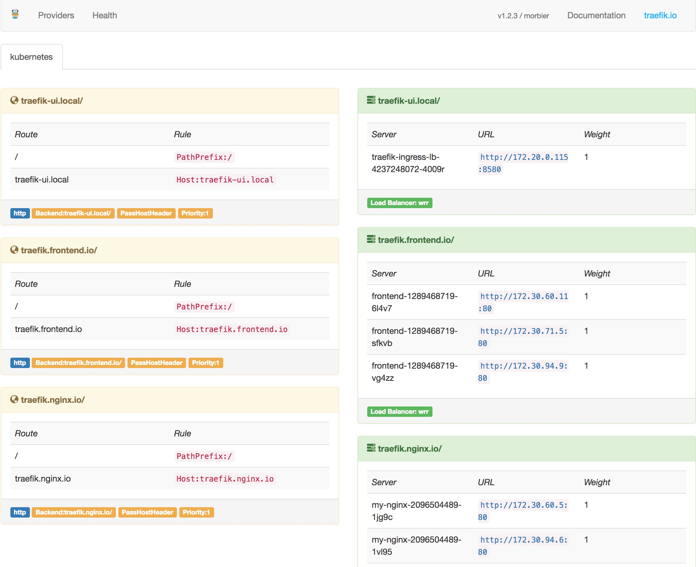
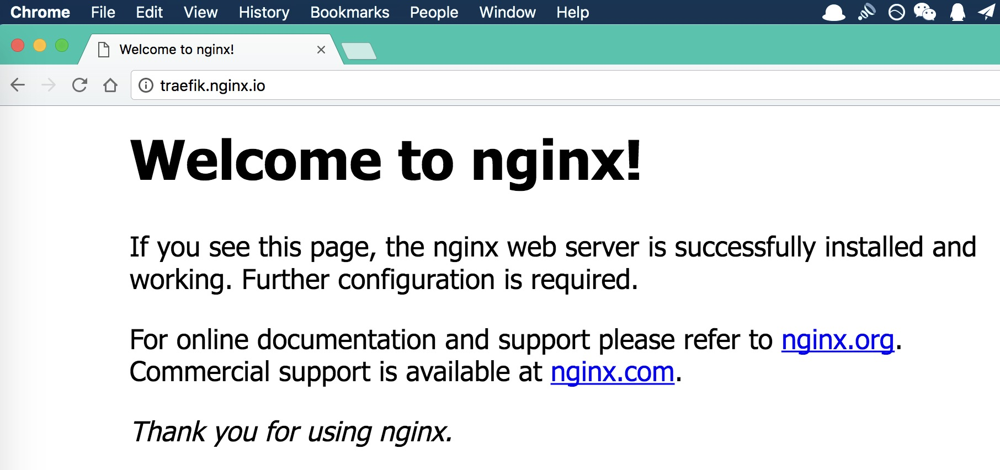

# Traefik ingress

[Traefik](https://traefik.io/)是一个开源的反向代理和负载均衡工具，它监听后端的变化并自动更新服务配置。


主要功能包括

- Golang编写，部署容易
- 快（nginx的85%)
- 支持众多的后端（Docker, Swarm, Kubernetes, Marathon, Mesos, Consul, Etcd等）
- 内置Web UI、Metrics和Let’s Encrypt支持，管理方便
- 自动动态配置
- 集群模式高可用

## Ingress简介

简单的说，ingress就是从kubernetes集群外访问集群的入口，将用户的URL请求转发到不同的service上。Ingress相当于nginx、apache等负载均衡反向代理服务器，其中还包括规则定义，即URL的路由信息，路由信息的刷新由[Ingress controller](https://kubernetes.io/docs/concepts/services-networking/ingress/#ingress-controllers)来提供。

Ingress Controller 实质上可以理解为是个监视器，Ingress Controller 通过不断地跟 kubernetes API 打交道，实时的感知后端 service、pod 等变化，比如新增和减少 pod，service 增加与减少等；当得到这些变化信息后，Ingress Controller 再结合下文的 Ingress 生成配置，然后更新反向代理负载均衡器，并刷新其配置，达到服务发现的作用。

## 部署Traefik

**介绍traefik**

[Traefik](https://traefik.io/)是一款开源的反向代理与负载均衡工具。它最大的优点是能够与常见的微服务系统直接整合，可以实现自动化动态配置。目前支持Docker, Swarm, Mesos/Marathon, Mesos, Kubernetes, Consul, Etcd, Zookeeper, BoltDB, Rest API等等后端模型。

以下配置文件可以在Traefik GitHub仓库中的[examples/k8s/traefik-rbac.yaml](https://github.com/containous/traefik/tree/master/examples/k8s/traefik-rbac.yaml)找到。

**创建ingress-rbac.yaml**

将用于service account验证。

```yaml
---
kind: ClusterRole
apiVersion: rbac.authorization.k8s.io/v1beta1
metadata:
  name: traefik-ingress-controller
rules:
  - apiGroups:
      - ""
    resources:
      - services
      - endpoints
      - secrets
    verbs:
      - get
      - list
      - watch
  - apiGroups:
      - extensions
    resources:
      - ingresses
    verbs:
      - get
      - list
      - watch
---
kind: ClusterRoleBinding
apiVersion: rbac.authorization.k8s.io/v1beta1
metadata:
  name: traefik-ingress-controller
roleRef:
  apiGroup: rbac.authorization.k8s.io
  kind: ClusterRole
  name: traefik-ingress-controller
subjects:
- kind: ServiceAccount
  name: traefik-ingress-controller
  namespace: kube-system
```

```sh
kubectl apply -f https://raw.githubusercontent.com/containous/traefik/master/examples/k8s/traefik-rbac.yaml
```

**创建Depeloyment**

```yaml
---
apiVersion: v1
kind: ServiceAccount
metadata:
  name: traefik-ingress-controller
  namespace: kube-system
---
kind: Deployment
apiVersion: extensions/v1beta1
metadata:
  name: traefik-ingress-controller
  namespace: kube-system
  labels:
    k8s-app: traefik-ingress-lb
spec:
  replicas: 1
  selector:
    matchLabels:
      k8s-app: traefik-ingress-lb
  template:
    metadata:
      labels:
        k8s-app: traefik-ingress-lb
        name: traefik-ingress-lb
    spec:
      serviceAccountName: traefik-ingress-controller
      terminationGracePeriodSeconds: 60
      containers:
      - image: traefik
        name: traefik-ingress-lb
        args:
        - --web
        - --kubernetes
---
kind: Service
apiVersion: v1
metadata:
  name: traefik-ingress-service
spec:
  selector:
    k8s-app: traefik-ingress-lb
  ports:
    - protocol: TCP
      port: 80
      name: web
    - protocol: TCP
      port: 8080
      name: admin
  type: NodePort
```

```sh
# 使用deployment部署
kubectl apply -f https://raw.githubusercontent.com/containous/traefik/master/examples/k8s/traefik-deployment.yaml
# 也可以使用daemonset来部署
# kubectl apply -f https://raw.githubusercontent.com/containous/traefik/master/examples/k8s/traefik-ds.yaml
```

注意我们这里用的是Deploy类型，没有限定该pod运行在哪个主机上。Traefik的端口是8580。

**创建名为`traefik-ingress`的ingress**，文件名traefik.yaml

```yaml
apiVersion: extensions/v1beta1
kind: Ingress
metadata:
  name: traefik-ingress
spec:
  rules:
  - host: traefik.nginx.io
    http:
      paths:
      - path: /
        backend:
          serviceName: nginx
          servicePort: 80
  - host: traefik.frontend.io
    http:
      paths:
      - path: /
        backend:
          serviceName: frontend
          servicePort: 80
```

这其中的`backend`中要配置default namespace中启动的service名字。`path`就是URL地址后的路径，如traefik.frontend.io/path，service将会接受path这个路径，host最好使用service-name.filed1.filed2.domain-name这种类似主机名称的命名方式，方便区分服务。

根据你自己环境中部署的service的名字和端口自行修改，有新service增加时，修改该文件后可以使用`kubectl replace -f traefik.yaml`来更新。

**Traefik UI**

```yaml
apiVersion: v1
kind: Service
metadata:
  name: traefik-web-ui
  namespace: kube-system
spec:
  selector:
    k8s-app: traefik-ingress-lb
  ports:
  - port: 80
    targetPort: 8080
---
apiVersion: extensions/v1beta1
kind: Ingress
metadata:
  name: traefik-web-ui
  namespace: kube-system
  annotations:
    kubernetes.io/ingress.class: traefik
spec:
  rules:
  - host: traefik-ui.nginx.io
    http:
      paths:
      - backend:
          serviceName: traefik-web-ui
          servicePort: 80
```

配置完成后就可以启动treafik ingress了。

```
kubectl create -f .
```

我查看到traefik的pod在`172.20.0.115`这台节点上启动了。

访问该地址`http://172.20.0.115:8580/`将可以看到dashboard。



左侧黄色部分部分列出的是所有的rule，右侧绿色部分是所有的backend。

## 测试

在集群的任意一个节点上执行。假如现在我要访问nginx的"/"路径。

```bash
$ curl -H Host:traefik.nginx.io http://172.20.0.115/
<!DOCTYPE html>
<html>
<head>
<title>Welcome to nginx!</title>
<style>
    body {
        width: 35em;
        margin: 0 auto;
        font-family: Tahoma, Verdana, Arial, sans-serif;
    }
</style>
</head>
<body>
<h1>Welcome to nginx!</h1>
<p>If you see this page, the nginx web server is successfully installed and
working. Further configuration is required.</p>

<p>For online documentation and support please refer to
<a href="http://nginx.org/">nginx.org</a>.<br/>
Commercial support is available at
<a href="http://nginx.com/">nginx.com</a>.</p>

<p><em>Thank you for using nginx.</em></p>
</body>
</html>
```

如果你需要在kubernetes集群以外访问就需要设置DNS，或者修改本机的hosts文件。

在其中加入：

```
172.20.0.115 traefik.nginx.io
172.20.0.115 traefik.frontend.io
```

所有访问这些地址的流量都会发送给172.20.0.115这台主机，就是我们启动traefik的主机。

Traefik会解析http请求header里的Host参数将流量转发给Ingress配置里的相应service。

修改hosts后就就可以在kubernetes集群外访问以上两个service，如下图：




## 参考文档

- [Traefik-kubernetes 初试](http://www.colabug.com/thread-1703745-1-1.html)
- [Traefik简介](http://www.tuicool.com/articles/ZnuEfay)
- [Guestbook example](https://github.com/kubernetes/kubernetes/tree/master/examples/guestbook)
